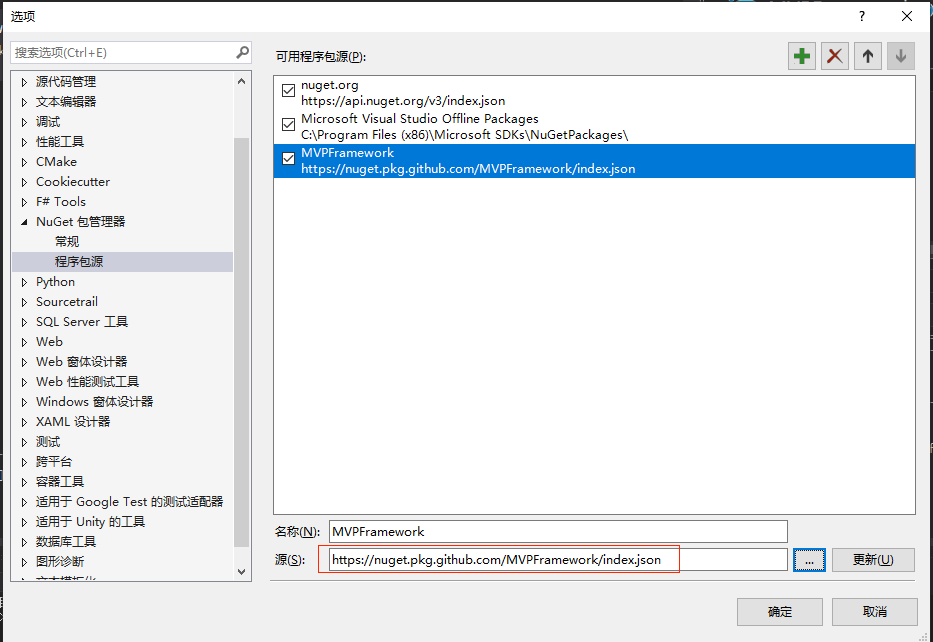

# MVPFramework
MVPFramework是一个基于C#实现的UI框架，旨在帮助开发者以一种较为优雅的方式快速搭建应用程序原型。它也是自己对UI框架设计的一些思想落地实现，而不仅仅局限于单一平台的使用。

### Features
 - 数据层和视图层的解耦合、界面和界面逻辑分离
 - 数据驱动UI

### 版本相关
|       平台       |      适用版本      |   分支   |  状态   |
| --------------- | ----------------- | -------- | ------- |
| Window XP 及以上 | .Net FrameWork4.0 | master | success |

注意: XP平台下需要主动安装.Net Framework4.0

### Getting Started
Nuget:
1. 添加Nuget地址，如下图:  

2. 在【浏览】页签下可找到MVPFramework

github  
1. clone 项目
```
git clone git@github.com:MVPFramework/MVPFramework.git
```
2. 编译项目，获取DLL引用即可

### 设计结构图
                              +--------------------------------------------------------------------------+                              
                              |                          MVPFramework                                    |                              
                              +--------------------------------------------------------------------------+                              
                                                                                                                                        
               +-------------+                            +------------------------------+                                              
               |= Model Layer|                            |= Presenter Layer             |                                              
               |             |----------send------------->|+----------------------------+|                                              
               |             |                            ||                            ||                             |   |            
               |             |                            ||                            ||                    +---------   ----------+  
               +-------------+                            ||                            ||                    |= Presenter Stub      |  
                                                          ||      Presenter List        ||-----register------>|                      |  
                                                          ||                            ||                    +----------------------+  
                                                          ||                            ||                               |              
                                                          ||                            ||                               |              
                                                          |+----------------------------+|                               |              
                                                          +------------------------------+                               |              
                                                                          |                                              |              
                                                                          |                                              |              
                                                                          n                                              |              
                                                                          :                                              |              
                                                                          n                                              |              
                                                                          |                                              |              
                                                                          |                                              |              
                                                                          V                                              |              
      +---------------------------------------------------------------------------------+                                |              
      |= View Layer                                                                     |                                |              
      |  +-------------------------+                      +----------------------------+|                                |              
      |  |= View Component Layer   |                      |= View Logic Layer          ||                                |              
      |  |                         |                      |                            ||                                V              
      |  |                         |                      |                            ||                    +----------------------+   
      |  |                         |<--------1:1--------->|                            ||                    |= View Logic Stub     |   
      |  |                         |                      |                            ||-----register------>|                      |   
      |  |                         |                      |                            ||                    +----------------------+   
      |  |                         |                      |                            ||                                               
      |  +-------------------------+                      +----------------------------+|                                               
      |---------------------------------------------------------------------------------+                                               

说明：
Model Layer: 只包含数据结构的定义(需要区别于传统的MVC中的Model层)  
Presenter Layer: 该层是极重的一层，包含数据的计算和缓存、界面的显示周期等  
View Layer:  
- View Component Layer: UI层  
- View Logic Layer: UI 逻辑层
